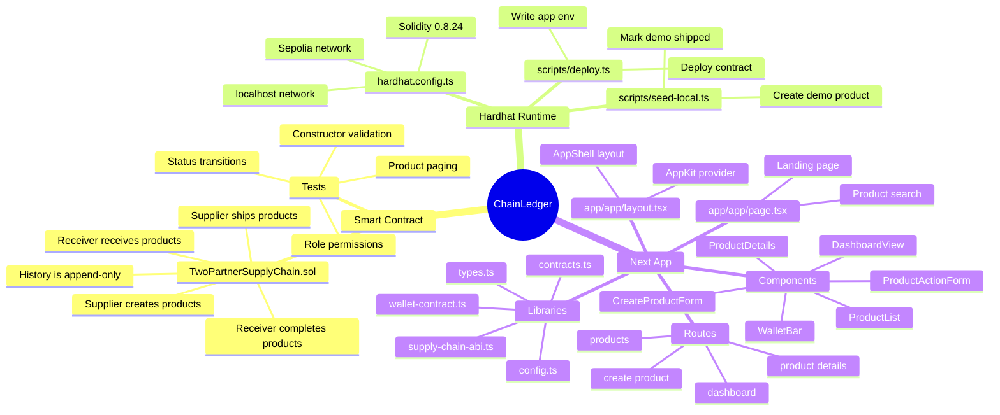
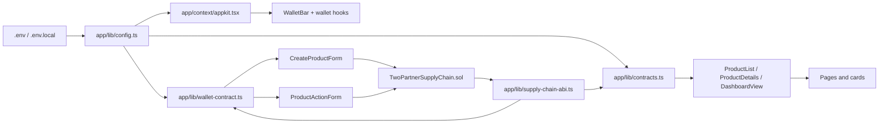
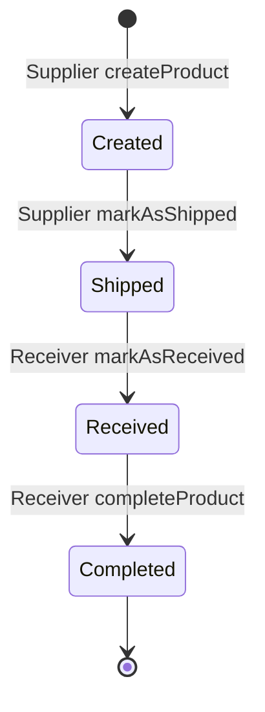
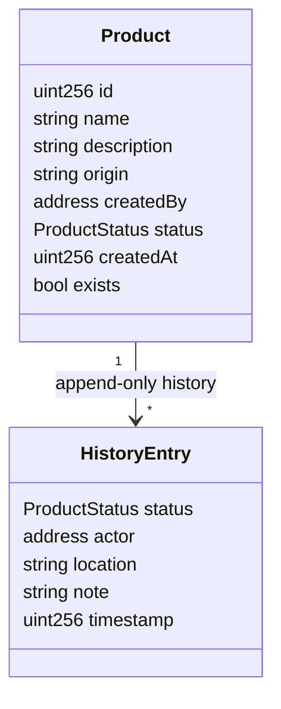

# ChainLedger Trace Summary

This file is a quick mind-map style trace of how the smart contract, deployment scripts, and Next.js frontend fit together.

## Mind Map

## Runtime Flow

## File Trace

| File | Role | Connects To |
| --- | --- | --- |
| `.env.example` | Documents required deploy and frontend environment variables. | `hardhat.config.ts`, `scripts/deploy.ts`, `app/lib/config.ts` |
| `.gitignore` | Keeps local env, dependencies, and build outputs out of git. | Repo hygiene |
| `package.json` | Root Hardhat scripts and blockchain dependencies. | `hardhat.config.ts`, `scripts/*`, `test/*` |
| `package-lock.json` | Locked root dependency graph. | `package.json` |
| `tsconfig.json` | TypeScript settings for Hardhat scripts/tests. | Root TS files |
| `hardhat.config.ts` | Hardhat configuration for contract sources, tests, compiler, localhost, and Sepolia. | `.env`, `scripts/deploy.ts`, `test/TwoPartnerSupplyChain.ts` |
| `smart_contracts/TwoPartnerSupplyChain.sol` | Core contract: two roles, product lifecycle, product reads, and append-only history. | ABI, tests, deploy script, frontend contract calls |
| `test/TwoPartnerSupplyChain.ts` | Contract behavior tests for roles, transitions, history, and reads. | `TwoPartnerSupplyChain.sol` |
| `scripts/deploy.ts` | Deploys the contract, chooses supplier/receiver, and writes frontend env values. | Hardhat networks, `app/.env.local` |
| `scripts/seed-local.ts` | Seeds a local deployment with a demo product and shipped status. | `app/.env.local`, local Hardhat contract |
| `types/ethers-contracts/index.ts` | Generated TypeChain export index. | Typed contract usage |
| `types/ethers-contracts/TwoPartnerSupplyChain.ts` | Generated typed contract interface. | Contract typing |
| `types/ethers-contracts/factories/index.ts` | Generated factory export index. | Contract factory typing |
| `types/ethers-contracts/factories/TwoPartnerSupplyChain__factory.ts` | Generated factory for contract deployment/connection. | TypeChain consumers |
| `types/ethers-contracts/common.ts` | Shared generated TypeChain helpers. | Generated contract types |
| `types/ethers-contracts/hardhat.d.ts` | Hardhat type augmentation for generated contracts. | Hardhat TypeScript typing |
| `two-partner-supply-chain-dapp-constitution.md` | Product/spec document for the DApp concept. | Design and implementation reference |

## Frontend Trace

| File | Role | Connects To |
| --- | --- | --- |
| `app/package.json` | Next.js app scripts and frontend dependencies. `dev` uses webpack mode. | Next, React, Reown/AppKit, ethers |
| `app/package-lock.json` | Locked frontend dependency graph. | `app/package.json` |
| `app/README.md` | Frontend setup docs and app-flow images. | `app/public/brand/*` |
| `app/AGENTS.md` | Local agent/developer guidance for the app. | Contributor workflow |
| `app/CLAUDE.md` | Local assistant/developer guidance for the app. | Contributor workflow |
| `app/next.config.ts` | Next config, including dev origins and Turbopack root. | Next runtime |
| `app/eslint.config.mjs` | ESLint config using Next core web vitals and TypeScript rules. | `npm run lint` |
| `app/postcss.config.mjs` | PostCSS/Tailwind pipeline config. | Tailwind CSS |
| `app/tsconfig.json` | TypeScript config for the Next app. | App TS/TSX files |
| `app/app/globals.css` | Global Tailwind import, CSS variables, base font/colors, selection styling. | All frontend routes |
| `app/app/layout.tsx` | Root HTML/body wrapper; loads fonts, AppKit, and AppShell. | `AppKit`, `AppShell` |
| `app/app/page.tsx` | Home/landing page with hero, workflow summary, product search, and links. | `ProductSearch`, config, brand image |
| `app/app/dashboard/page.tsx` | Dashboard route shell. | `DashboardView` |
| `app/app/products/page.tsx` | Product registry route with search and list. | `ProductSearch`, `ProductList` |
| `app/app/products/create/page.tsx` | Supplier create-product route. | `CreateProductForm` |
| `app/app/products/[id]/page.tsx` | Dynamic product-detail route. | `ProductDetails` |
| `app/app/favicon.ico` | Browser tab icon. | Next metadata/static asset |

## Frontend Library Trace

| File | Role | Connects To |
| --- | --- | --- |
| `app/lib/config.ts` | Central chain/env config: Sepolia/local mode, RPC URL, contract address, explorer URLs. | AppKit, read/write contracts, UI network labels |
| `app/lib/types.ts` | Shared product, history, role, status, and transaction state types. | Components and contract helpers |
| `app/lib/supply-chain-abi.ts` | Minimal ABI used by ethers for read/write calls. | `contracts.ts`, `wallet-contract.ts` |
| `app/lib/contracts.ts` | Read-only ethers helper: fetch products, product details, roles, partners, formatting, errors. | Product list/details, dashboard, wallet role display |
| `app/lib/wallet-contract.ts` | Write-contract helper using connected wallet provider and signer. | Create/update forms |
| `app/context/appkit.tsx` | Reown AppKit setup for Sepolia or local Hardhat chain. | Wallet hooks, `layout.tsx` |

## Component Trace

| File | Role | Reads/Writes |
| --- | --- | --- |
| `app/components/app-shell.tsx` | Persistent header/nav wrapper around every page. | Uses `WalletBar`, network label |
| `app/components/wallet-bar.tsx` | Wallet connect/account/network controls and role badge. | Reads role via `fetchRole`; switches network via AppKit |
| `app/components/dashboard-view.tsx` | Role-aware dashboard, supplier create link, viewer warning, product list. | Reads role; renders `ProductList` and `ProductSearch` |
| `app/components/create-product-form.tsx` | Supplier-only product creation form with placeholders and transaction alert. | Writes `createProduct`; reads wallet role/network |
| `app/components/product-action-form.tsx` | Status-transition form for shipping, receiving, and completion. | Writes `markAsShipped`, `markAsReceived`, `completeProduct` |
| `app/components/product-list.tsx` | Loads and displays product cards with refresh/error/empty states. | Reads `fetchProducts` |
| `app/components/product-card.tsx` | Compact product summary card linking to details. | Formats product data |
| `app/components/product-details.tsx` | Product detail page body with timeline, refresh, and action form. | Reads `fetchProduct`; writes through `ProductActionForm` |
| `app/components/product-timeline.tsx` | Renders append-only history entries. | Formats history actor/date/status |
| `app/components/product-search.tsx` | Product ID search form that routes to `/products/[id]`. | Next router |
| `app/components/status-badge.tsx` | Visual status pill for Created/Shipped/Received/Completed. | Shared by cards, details, timeline |
| `app/components/tx-alert.tsx` | Transaction status message and explorer link. | `explorerTxUrl` |

## Public Asset Trace

| File | Role | Used By |
| --- | --- | --- |
| `app/public/brand/chainledger-hero.png` | Landing page hero image. | `app/app/page.tsx` |
| `app/public/brand/chainledger-app-flow.png` | English app-flow infographic. | `app/README.md` |
| `app/public/brand/chainledger-app-flow-ar.png` | Arabic app-flow infographic with shaped RTL text. | `app/README.md` |
| `app/public/brand/chainledger-app-flow-ar.svg` | Editable/source-style Arabic flow asset. | Reference/source asset |
| `app/public/file.svg` | Default Next starter asset. | Static asset |
| `app/public/globe.svg` | Default Next starter asset. | Static asset |
| `app/public/next.svg` | Default Next starter asset. | Static asset |
| `app/public/vercel.svg` | Default Next starter asset. | Static asset |
| `app/public/window.svg` | Default Next starter asset. | Static asset |

## Main User Journeys

### Supplier

1. Connect wallet in `WalletBar`.
2. Role is fetched by `fetchRole`.
3. Open dashboard or create page.
4. Submit `CreateProductForm`.
5. Later open product details and submit `ProductActionForm` for shipping.

### Receiver

1. Connect wallet in `WalletBar`.
2. Open shipped product details.
3. Submit `ProductActionForm` to confirm received.
4. Submit again after received to complete product.

### Viewer

1. Browse `/products` or use `ProductSearch`.
2. Open `/products/[id]`.
3. Read product details and immutable timeline.
4. Follow transaction links from alerts/history context where available.

## Contract State Machine

## Data Shape

