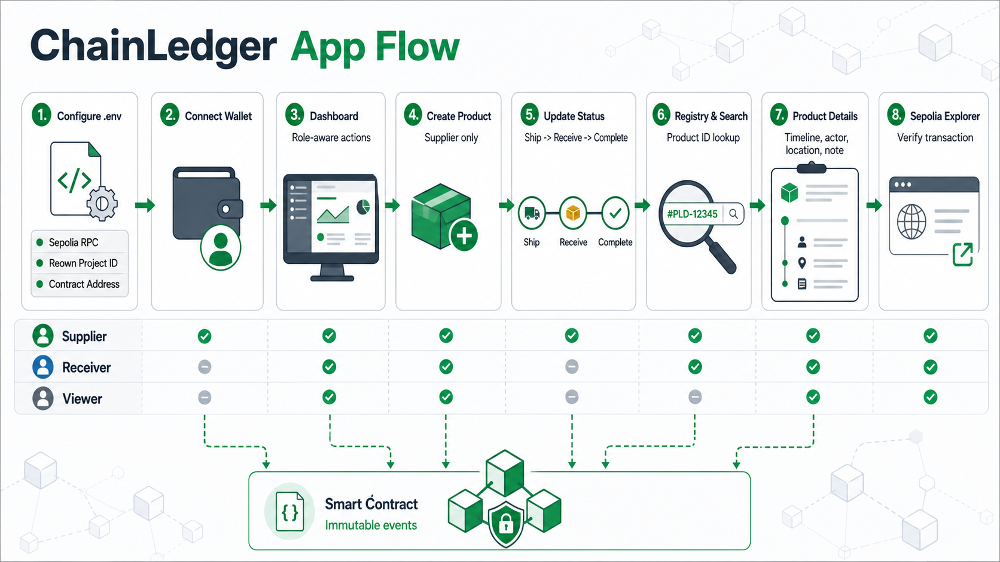
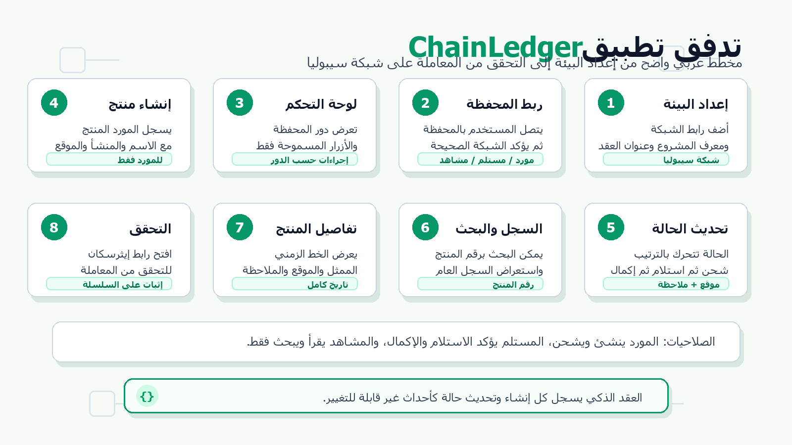

# Two-Partner Supply Chain Frontend

Next.js App Router frontend for the Sepolia `TwoPartnerSupplyChain` contract.

## App Flow



## تدفق التطبيق بالعربية



## Setup

Install dependencies:

```bash
npm install
```

Create `.env.local` from `.env.example`:

```env
NEXT_PUBLIC_REOWN_PROJECT_ID=
NEXT_PUBLIC_SUPPLY_CHAIN_CONTRACT_ADDRESS=
NEXT_PUBLIC_INFURA_API_KEY=
NEXT_PUBLIC_BLOCK_EXPLORER_URL=https://sepolia.etherscan.io
```

`NEXT_PUBLIC_INFURA_API_KEY` is used for Sepolia read calls. If it is empty, the app falls back to a public Sepolia RPC for local learning.

Run the app:

```bash
npm run dev
```

The dev script uses Next's webpack compiler because the current wallet
dependencies can hang during first-page compilation under Turbopack dev.

## Routes

- `/` overview and product search
- `/products` list and search
- `/products/create` Supplier-only create form
- `/products/[id]` product details, status action, and timeline
- `/dashboard` connected wallet role dashboard
